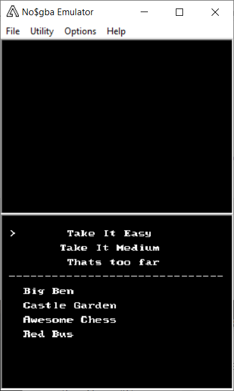
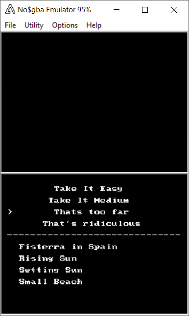
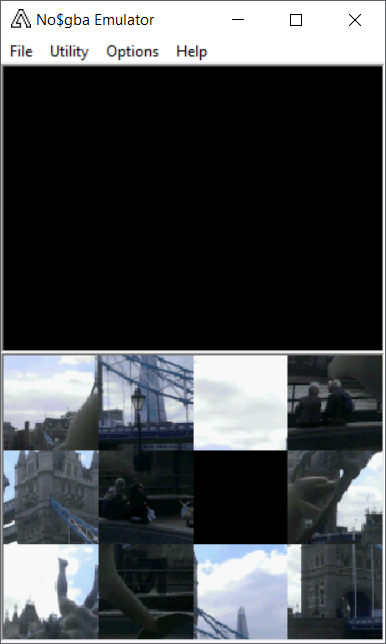
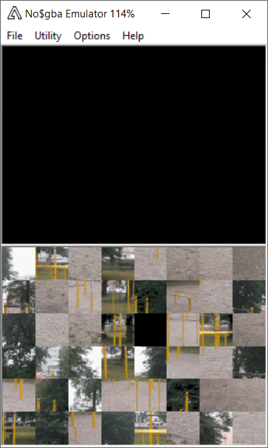

# DragTilesPuzzle
A puzzle game for the game console Nintendo DS implemented with help of the devkitPro Toolchain.
To play simply download the *.nds file and run it with an emulator like no$gba.

# How to play
Drag tiles with the touch pen and put them into the correct order. Moving with the cross also works.

# Shots from the game

   